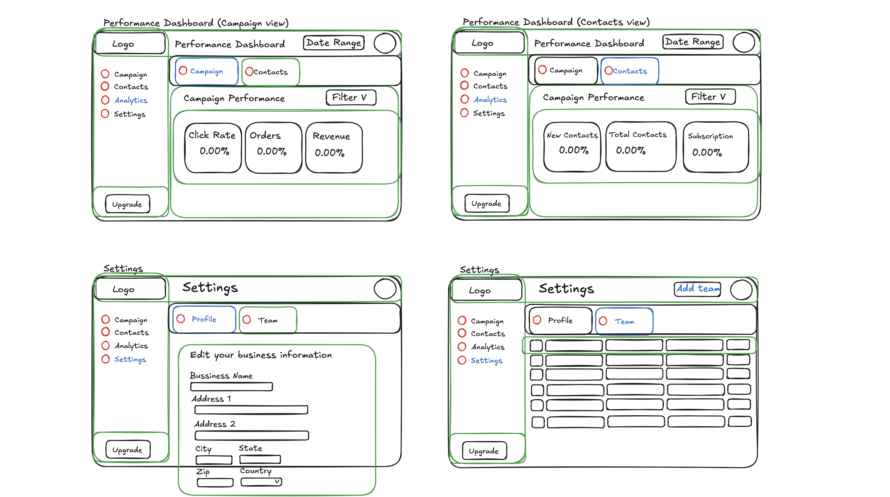

# emailCRM

This full stack app will include Next.js, TypeScript, Tailwind CSS, ShadCN/ui, a dockerized Postgres DB, Drizzle ORM, Zod, next-safe-action, react-hook-form, next-safe-action, and TanStack Table.

Wireframes:

- Login and onboarding users:
  
- Main Scenes - Campaigns and Contacts
  
- Main Scenes - Performance Dashboard and Settings
  
